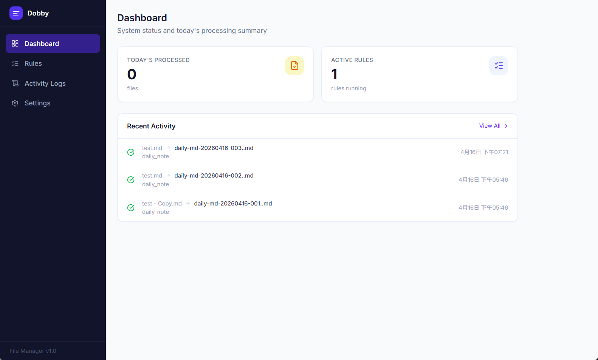
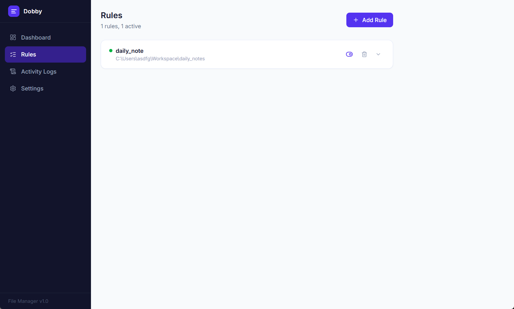
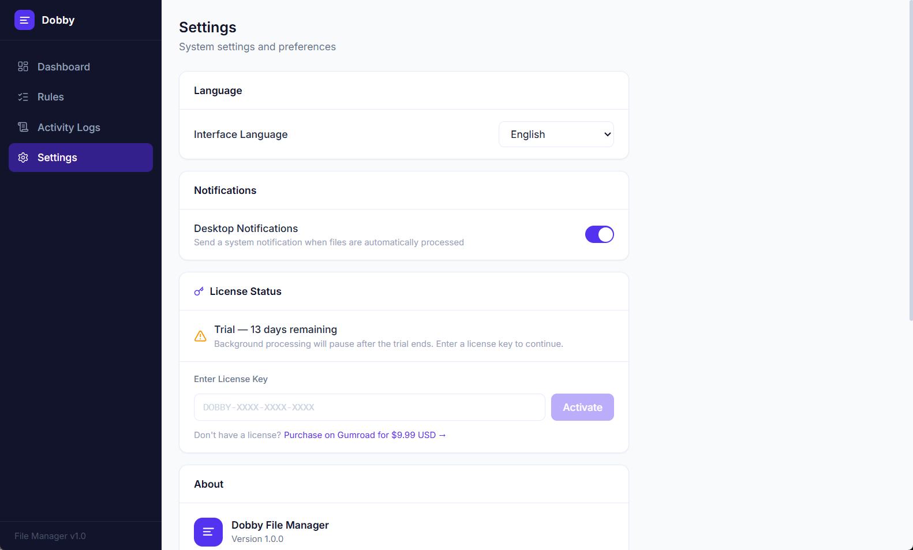

# Dobby — File Manager

**Automatically rename and organize your files the moment they appear — no manual work required.**

Dobby watches folders you choose, applies your custom rules, and moves incoming files to the right place with the right name. Set it up once, let it run forever.

---

## Overview



At a glance: how many files were processed today, how many rules are running, and a live feed of recent file activity.

### Before & After


Left: a folder full of unsorted files. Right: the same folder after Dobby runs — files automatically renamed and moved into the right subfolders, with nothing left for you to do.

---

## Features

- **Rule-based automation** — Define exactly which files to watch, how to name them, and where to move them
- **Flexible name templates** — Use variables like `{project}`, `{type}`, `{YYYY}{MM}{DD}`, `{seq}` to generate consistent, meaningful filenames
- **Filter by extension or keyword** — Target only the files you care about (e.g. `.png`, `.pdf`, or filenames containing a specific word)
- **Activity log** — Every processed file is recorded with its original path, new path, applied rule, and timestamp
- **Desktop notifications** — Get notified the moment a file is processed
- **Runs silently in the background** — No interaction needed after setup

---

## Rules



The Rules page lists all your automation rules. Each rule shows its name, watch folder, and current status. You can toggle a rule on/off or delete it at any time.

### Creating a Rule


Click **+ Add Rule** to open the rule editor. Configure:

| Field | Description |
|-------|-------------|
| **Rule Name** | A label to identify this rule (e.g. `Design Files`) |
| **Watch Folder** | The folder Dobby monitors for new files |
| **File Extensions** | Filter by type — leave empty to match all files |
| **Keyword Filter** | Only process files whose name contains this word |
| **Project Name / Type Label** | Custom values injected into the filename template |
| **Name Template** | The output filename pattern using `{variables}` |

**Available template variables:**

| Variable | Meaning |
|----------|---------|
| `{project}` | Your project name |
| `{type}` | Your type label |
| `{YYYY}` | 4-digit year |
| `{MM}` | 2-digit month |
| `{DD}` | 2-digit day |
| `{seq}` | Auto-incrementing sequence number |
| `{original}` | Original filename (without extension) |

**Example:** A rule with template `{project}-{type}-{YYYY}{MM}{DD}-{seq}.{ext}` applied to a file dropped into the watch folder produces `my-project-screenshot-20260418-001.png`.

---

## Activity Logs


Every file operation is recorded. Filter by rule to quickly audit what happened, with the exact original path, output path, rule that matched, and timestamp.

---

## Settings



The Settings page is divided into four sections. Here's what each field does:

### Language

| Field | Description |
|-------|-------------|
| **Interface Language** | Switches the display language for the entire app. Currently supports **Traditional Chinese** and **English**. The change takes effect immediately — no restart needed. |

### Notifications

| Field | Description |
|-------|-------------|
| **Desktop Notifications** | When turned on, Dobby sends a system notification each time a file is processed. Turn it off if you prefer to check the Activity Log manually instead. |

### License

| Field | Description |
|-------|-------------|
| **Status** | Shows the current state of your copy: **Activated** (full access), **Trial** (shows days remaining), or **Expired** (background processing is paused until a key is entered). |
| **License Key** | The key you received after purchase. Paste it here and click **Activate** to unlock the full version. Format: `XXXXXXXX-XXXXXXXX-XXXXXXXX-XXXXXXXX`. |

> Don't have a key yet? Dobby is **$9.99 USD** — one-time purchase, no subscription. [Buy here.](https://afternoonjames.gumroad.com/l/dobby-tidy)

### About

Displays the app name and current version number. No editable fields.

---

## Pricing

Dobby is available for **$9.99 USD** — one-time purchase, no subscription.

A free trial is included (14 days). After the trial, background processing pauses until a license key is activated.

---

## Getting Started

1. Download and install Dobby
2. Open the app and go to **Rules**
3. Click **+ Add Rule** and configure your first rule
4. Drop a file into your watched folder — Dobby handles the rest

---

## For Developers

<details>
<summary>Tech stack, local development, and project structure</summary>

### Tech Stack

| Layer | Technology |
|-------|------------|
| Desktop Framework | [Wails v2](https://wails.io) (Go backend + native WebView) |
| Backend Language | Go 1.21+ |
| Architecture Pattern | Tactical DDD (Aggregate, Repository, Domain Service) |
| Database | SQLite via `modernc.org/sqlite` (pure Go, no CGO required) |
| Frontend | React + Vite (TypeScript) |

### Prerequisites

| Tool | Version | Installation |
|------|---------|--------------|
| Go | 1.21+ | https://go.dev/dl/ |
| Wails CLI | v2.x | `go install github.com/wailsapp/wails/v2/cmd/wails@latest` |
| Node.js | 18+ | https://nodejs.org |

**Windows:** WebView2 Runtime is built into Windows 11. Windows 10 users can download it from the [Microsoft website](https://developer.microsoft.com/en-us/microsoft-edge/webview2/).

**macOS:** Run `xcode-select --install`.

### Local Development

```bash
git clone <repo-url>
cd Dobby-Files/dobby
go mod download
wails dev
```

### Running Tests

```bash
cd dobby
go test ./...
```

### Build for Production

```bash
cd dobby
wails build
# Output: dobby/build/bin/dobby.exe (Windows) or dobby/build/bin/dobby (macOS)
```

### Database Location

| Platform | Path |
|----------|------|
| Windows | `%USERPROFILE%\.dobby\dobby.db` |
| macOS / Linux | `~/.dobby/dobby.db` |

Schema migrations are applied automatically at startup — no manual SQL required.

### Project Structure

```
Dobby-Files/
├── dobby/
│   ├── main.go                    # Wails entry point, DI assembly
│   ├── app.go                     # Wails binding shell
│   └── internal/
│       ├── domain/
│       │   ├── rule/              # Rule aggregate, value objects
│       │   ├── job/               # ProcessingJob state machine
│       │   └── service/           # RuleMatcher, TemplateRenderer, SequenceGenerator
│       ├── application/
│       │   ├── rule_service.go    # Rule CRUD use cases
│       │   └── log_service.go     # Operation log use cases
│       ├── infrastructure/
│       │   └── persistence/       # SQLite repositories + migrations
│       └── query/
│           └── operation_log_query.go
├── features/
│   └── file-manager.feature       # Gherkin behavior spec
└── docs/
    └── features/file-manager/
```

</details>
